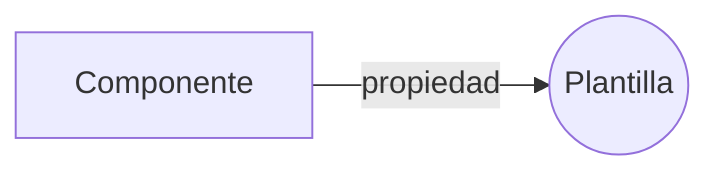
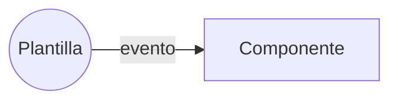
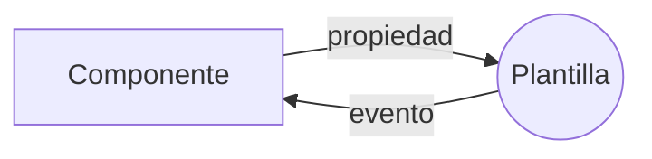

# **Introducción a las plantillas:**

- Las plantillas en Angular se utilizan para definir la UI (interfaz de usuario) de una aplicación.
- Están escritos en HTML y pueden contener sintaxis y directivas específicas de Angular.
- Las plantillas se pueden definir en línea o en un archivo separado.

```html
<!-- archivo app.component.html -->
<h1>{{title}}</h1>
<p>{{description}}</p>
```

En este ejemplo, la plantilla define un encabezado (h1) y un párrafo (p). Las llaves dobles ({{}}) se utilizan para hacer referencia a las propiedades del componente de Angular que se van a enlazar en la plantilla.

---

# **Enlace de propiedad:**

- El enlace de propiedad se utiliza para establecer el valor de la propiedad de un elemento en la plantilla.
- Le permite vincular el valor de una propiedad de componente a una propiedad de elemento, como el valor de un campo de entrada o la fuente de una imagen.
- El enlace de propiedad se indica mediante corchetes (`[]`) en la plantilla.



```html
<input [valor]="name" />
```

En este ejemplo, la propiedad `value` del elemento `input` se establece en la propiedad `nombre` del componente de Angular.

---

# **Enlace de eventos**

- El enlace de eventos se usa para manejar eventos de usuario, como clics o pulsaciones de teclas, en la plantilla.
- Le permite vincular un evento en un elemento a un método de componente, que se ejecuta cuando se activa el evento.
- El enlace de eventos se indica entre paréntesis (`()`) en la plantilla.



```html
<button (click)="onClick()">¡Haz clic en mí!</button>
```

En este ejemplo, el método `onClick()` del componente de Angular se ejecutará cuando el usuario haga clic en el botón.


---

# **Enlace bidireccional:**

- El enlace bidireccional se utiliza para vincular una propiedad de componente con el valor de un elemento de entrada, de modo que los cambios en el componente o en la plantilla se sincronicen automáticamente.
- Te permite actualizar el modelo y la vista simultáneamente, sin tener que escribir código adicional.
- El enlace bidireccional se indica mediante una combinación de corchetes y paréntesis (`[()]`) en la plantilla.



```html
<input [(ngModel)]="name" />
```

En este ejemplo, la propiedad `name` del componente de Angular se actualiza automáticamente cuando el usuario cambia el valor del input.


> Es importante tener en cuenta que el enlace bidireccional requiere que el módulo FormsModule esté importado en el módulo de la aplicación.