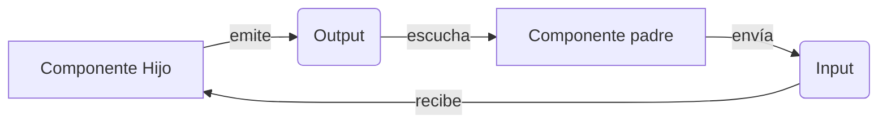
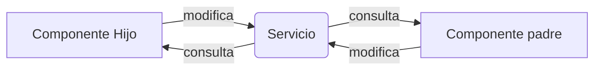

# **Ciclo de vida de los componentes:**

- Angular proporciona varias fases de ciclo de vida que le permiten ejecutar código en puntos específicos durante la vida útil de un componente.
- Estoas fases incluyen ngOnInit, ngOnChanges, ngOnDestroy y más.
- Se pueden usar para realizar inicializaciones, responder a cambios y limpiar recursos.

El ciclo de vida de los componentes se puede dividir en los siguientes eventos:

- `OnInit`: Este evento se dispara cuando un componente se inicializa después de que todas sus propiedades vinculadas se hayan inicializado.
- `OnDestroy`: Este evento se dispara justo antes de que un componente sea eliminado y destruido.
- `OnChanges`: Este evento se dispara cuando una propiedad de entrada de un componente cambia.
- `AfterViewInit`: Este evento se dispara cuando la vista del componente se ha inicializado y todas las directivas hijo se han inicializado.

---

```typescript
import { Component, OnInit, OnDestroy } from "@angular/core";

@Component({
  selector: "app-lifecycle",
  template: "<p>Current value: {{ currentValue }}</p>",
})
export class LifecycleComponent implements OnInit, OnDestroy {
  currentValue = "";

  constructor() {}

  ngOnInit(): void {
    console.log("ngOnInit called");
    this.currentValue = "initialized";
  }

  ngOnDestroy(): void {
    console.log("ngOnDestroy called");
  }
}
```

---

# **Decoradores de entrada y salida:**

- Los decoradores ` @Input` y `@Output` se utilizan para comunicarse entre componentes principales y secundarios en Angular.

- `@Input` se usa para pasar datos del componente principal al componente secundario.

- `@Output` se usa para emitir eventos desde el componente secundario al componente principal.

---

Aquí hay un ejemplo del uso de decoradores de entrada y salida:

```typescript
import { Component, Input, Output, EventEmitter } from "@angular/core";

@Component({
  selector: "app-input-output",
  template: `
    <p>Input value: {{ inputValue }}</p>
    <button (click)="increment()">Increment</button>
  `,
})
export class InputOutputComponent {
  @Input() inputValue = 0;
  @Output() incremented = new EventEmitter<number>();

  increment(): void {
    this.inputValue++;
    this.incremented.emit(this.inputValue);
  }
}
```

---

# **Interacción de componentes:**

- Angular proporciona varias formas de interactuar entre componentes, como usar decoradores @Input y @Output, usar un servicio compartido o usar una referencia local.

Interacción con decoradores:


---

```typescript
import { Component } from "@angular/core";

@Component({
  selector: "app-parent",
  template: `
    <p>Parent component</p>
    <app-child
      [inputValue]="parentValue"
      (incremented)="handleIncrement($event)"
    ></app-child>
  `,
})
export class ParentComponent {
  parentValue = 0;

  handleIncrement(value: number): void {
    this.parentValue = value;
  }
}
```


---

```typescript
@Component({
  selector: "app-child",
  template: `
    <p>Child component</p>
    <p>Input value: {{ inputValue }}</p>
    <button (click)="increment()">Increment</button>
  `,
})
export class ChildComponent {
  @Input() inputValue = 0;
  @Output() incremented = new EventEmitter<number>();

  increment(): void {
    this.inputValue++;
    this.incremented.emit(this.inputValue);
  }
}
```

---

Interacción con un servicio:



```typescript
@Injectable({
  providedIn: "root",
})
export class DataService {
  data = "Hello, world!";
}

@Component({
  selector: "app-child",
  template: `
    <h2>Child Component</h2>
    <p>{{ data }}</p>
  `,
})
export class ChildComponent {
  data: string;

  constructor(private dataService: DataService) {}

  ngOnInit() {
    this.data = this.dataService.data;
  }
}
```
---

```typescript
@Component({
  selector: "app-parent",
  template: `
    <h1>Parent Component</h1>
    <app-child></app-child>
  `,
})
export class ParentComponent {}
```
